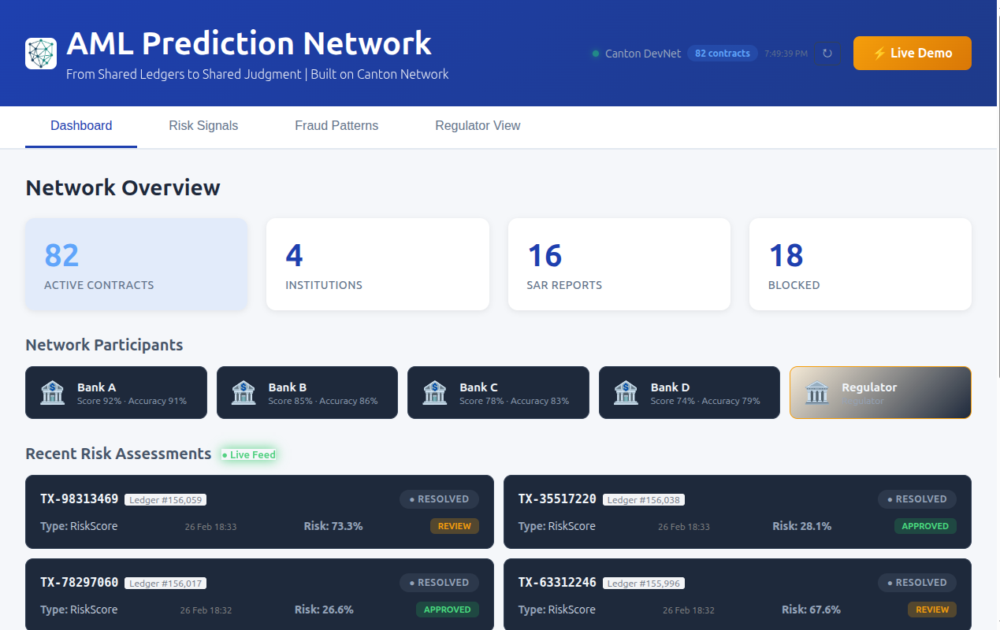

# AML Prediction Network

**From Shared Ledgers to Shared Judgment**

A privacy-preserving coordination layer that turns isolated institutional judgments into shared probabilistic awareness — built on Canton Network.

🏆 **Canton Catalyst 2026 Winner** — Currently in Mentorship Program

**Landing Page:** [amlprediction.com](https://amlprediction.com)
**Live Demo:** [amlprediction.network](https://amlprediction.network)
**Video:** [youtu.be/6mbqRq8GPiA](https://youtu.be/6mbqRq8GPiA)



---

## The Problem

Financial crime detection fails not because institutions lack analytics, but because each institution observes only a partial transaction graph. Regulatory and competitive boundaries prevent raw data sharing. Risk becomes visible only when signals are combined — yet combination is exactly what the law prohibits.

**What this looks like in practice:**

```
Monday  9:00 AM — Bank A flags a suspicious $25K wire transfer
Monday  9:30 AM — Same person opens an account at Bank B
Monday 10:00 AM — Moves $40K through Bank B, undetected
Monday 11:00 AM — Funds exit through Bank C to an offshore account
```

Bank A had the suspicion. But it could not share it — not because of technology, but because of regulation. Each bank was forced to decide alone, with incomplete information.

**The result:** $206B annual compliance spend, 95% false positive rates, and the same fraudsters cycling through multiple banks undetected.

This is not an analytics problem. It is a coordination failure.

---

## The Solution

AML Prediction Network introduces **probabilistic risk signaling** — a coordination primitive where institutions share calibrated confidence, not data.

```
┌──────────┐   ┌──────────┐   ┌──────────┐
│  Bank A   │   │  Bank B   │   │  Bank C   │
│ confidence│   │ confidence│   │ confidence│
│  signal   │   │  signal   │   │  signal   │
└─────┬─────┘   └─────┬─────┘   └─────┬─────┘
      │               │               │
      └───────────────┼───────────────┘
                      ▼
        ┌──────────────────────────┐
        │     Canton Network       │
        │  (privacy-preserving     │
        │   aggregation layer)     │
        └────────────┬─────────────┘
                     ▼
          ┌─────────────────────┐
          │  Shared Risk Score  │
          │  (collective output)│
          └─────────────────────┘
```

Each institution computes a local probability estimate about a risk hypothesis. They do not share transaction data, customer information, or internal model outputs. Instead, they submit a structured belief commitment.

The network aggregates these into a single risk outcome that all participants can rely on — without any participant learning another's private reasoning.

**This converts isolated detection into collective inference.**

---

## Why Canton

This mechanism requires properties unavailable in traditional infrastructure:

- **Selective visibility** — participants only see what they are permitted to see
- **Multi-party workflow execution** — decisions are jointly formed, not centrally computed
- **Shared state transition** — everyone relies on the same outcome
- **Institutional permissioning** — regulated entities, not anonymous actors

Public blockchains expose too much state. Traditional databases cannot coordinate across mutually untrusted parties.

Canton enables coordination without disclosure.

---

## What's Implemented

This prototype demonstrates:

- Multi-party Daml contracts for belief commitments
- Privacy-scoped risk signal submission
- Weighted aggregation with reputation scoring
- SAR auto-filing at configurable thresholds
- Regulator observer mode (read-only audit trail)
- Interactive demo environment
- Canton DevNet deployment

### Smart Contracts

| Contract | Purpose |
|----------|---------|
| `PredictionMarket.daml` | Belief submission, weighted risk scoring, SAR triggers |
| `BankReputation.daml` | Prediction accuracy tracking, voting weight adjustment |
| `TransactionPattern.daml` | Fraud pattern templates, suspicious transaction matching |
| `Setup.daml` | DevNet party setup (banks, regulator, operator) |

---

## Running the Prototype

### Prerequisites
- Canton SDK / DevNet
- Daml SDK 2.x
- Node.js 18+
- Docker (optional)

### 1. Start Canton Sandbox
```bash
cd daml/aml-network
daml start
```

### 2. Deploy Contracts
```bash
daml deploy --participant participant1
```

### 3. Run Frontend
```bash
cd frontend
npm install
npm run dev
```

### 4. Simulate Participants

Submit risk signals via frontend UI, Daml script, or REST API. Aggregated output updates in real time.

---

## Tech Stack

| Layer | Technology |
|-------|-----------|
| Smart Contracts | Daml 2.x (Canton Network SDK) |
| Backend | Node.js, Python (Canton integration) |
| Frontend | React + TypeScript, Recharts |
| Privacy | Canton selective disclosure, differential privacy |
| Deployment | Vercel (frontend), Canton DevNet (contracts) |

---

## Scope & Intent

This prototype validates a coordination mechanism: can independent institutions form a shared risk judgment without sharing data?

Production deployment, banking integrations, and regulatory reporting pipelines are future engineering challenges — not current scope.

The focus is mechanism validity, not operational completeness.

---

## Roadmap

**Phase 1: Prototype** ✅
Daml contracts, weighted aggregation, reputation scoring, demo environment, DevNet deployment

**Phase 2: Mechanism Hardening** (Current)
Adversarial testing, expanded participant simulation, regulator feedback integration

**Phase 3: Generalization**
Federated model-assisted belief generation, adaptive hypothesis markets, extension beyond AML to sanctions, credit risk, and market abuse signaling

The long-term vision: a financial system where institutions coordinate knowledge without surrendering sovereignty.

---

## Research Direction

AML is the first application, not the final one. The same coordination primitive applies wherever regulated parties must form shared judgments under privacy constraints:

- Market abuse signaling
- Credit risk coordination
- Sanctions intelligence sharing
- Interbank liquidity stress detection

---

## Related Materials

- [Light Paper](LIGHT_PAPER.md) — Mechanism design and theoretical foundation
- [Roadmap](ROADMAP.md) — Development milestones
- [Architecture](docs/architecture.md) — System design
- [Project Structure](PROJECT_STRUCTURE.md) — Repository layout

---

## Team

**Levent Ceyhan** — Founder & Builder (LeventLabs)
Full-stack: Daml, React, Node, Python

Open to collaboration — looking for:
- AML/compliance domain experts
- Canton/Daml developers
- Design partners (institutions interested in pilot)

---

## License

MIT License

---

🏆 Canton Catalyst 2026 Winner
